# Building a Daily Log Tracker: Google Sheets + Apps Script + iPhone Shortcuts

A personal experiment: log what I'm doing throughout the day (task, urgent?,
important?, how long it took, how it made me feel) with one tap on my phone,
an end-of-day retrospective with a second tap, and a Google Sheets dashboard
that turns all of it into stats — all with no app, no server I have to run,
and no cost.

This is the write-up of how it's built, including the bugs I actually hit
along the way, because the debugging is the part most tutorials skip.

**Template Google Sheet:** [Daily Time Tracker Dashboard – Template](https://docs.google.com/spreadsheets/d/1Rv4KTB3ym3NJeISpJA3bVLfy3RnNjRVR1LOl4zLqS34/edit?gid=592280567#gid=592280567)
— open it, then **File → Make a copy** to get your own editable version with
the Dashboard formulas intact. The Apps Script code lives in this repo under
[`code/Code.gs`](code/Code.gs); the copy step above does bring the script with it as well, but do check that once and update accordingly. If it isn't there just follow the steps and you'll be fine.

---

## The idea

Most time-tracking templates use a fixed grid: one row per 30-minute slot,
one column per attribute. That works until you actually try to log from your
phone — now you have to figure out *which* row you're in before you can write
anything, and every log type (a task, a mood check-in) needs its own rigid
slot.

The simpler model: **one append-only table.** Every time you log something,
it's just a new row, timestamped automatically. No slot-matching, no
"which sheet." A separate Dashboard sheet reads that table with formulas and
recomputes stats for whatever day you point it at.

## The data model

Everything lives in one sheet called `Logs`, with two kinds of rows:

| Column | Meaning | Used by |
|---|---|---|
| Timestamp | Set automatically the moment you log | all rows |
| Type | `task` or `retro` | all rows |
| Task | What you were doing | `task` rows |
| Urgent | `Y` / `N` | `task` rows |
| Important | `Y` / `N` | `task` rows |
| TimeTakenMin | How long it took, in minutes | `task` rows |
| Mood | `Positive` / `Neutral` / `Negative` | optional on `task`, required on `retro` |
| Energy | `Positive` / `Neutral` / `Negative` | optional on `task`, required on `retro` |
| Note | Free text | optional on both `task` and `retro` rows |

A `task` row is a normal thing you did, with an optional mood/energy rating
attached directly to it if you want one. A `retro` row is a once-a-day
end-of-day reflection — required mood and energy, optional note.

The Dashboard sheet has one input cell (a date) and pulls everything else —
the classic Urgent/Important matrix, per-task mood/energy percentages, and
the day's retrospective — with formulas that filter the log by that date.

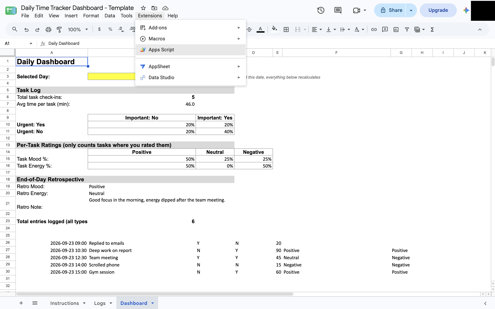
*The finished Dashboard, reading from `Logs` via formulas — this is also
where you'll find Apps Script under the Extensions menu.*

---

## Part 1: The Apps Script backend

The script is a **container-bound** Apps Script project — meaning it lives
*inside* the Google Sheet itself (opened via `Extensions → Apps Script`
directly from the sheet, not created separately at script.google.com). That
matters for one reason: `SpreadsheetApp.getActiveSpreadsheet()` always
resolves to "whichever sheet this script is inside," so there's no Sheet ID
to configure, and no way for it to accidentally write to the wrong file.

The full code is at [`code/Code.gs`](code/Code.gs). The short version of what
it does:

- `doPost(e)` receives a JSON body from the Shortcut, checks a shared secret,
  validates the `type`, and appends one row to `Logs` with the current
  timestamp plus whatever fields were sent.
- Fields that don't apply to a given row type are just sent as empty strings.

### Deploying it

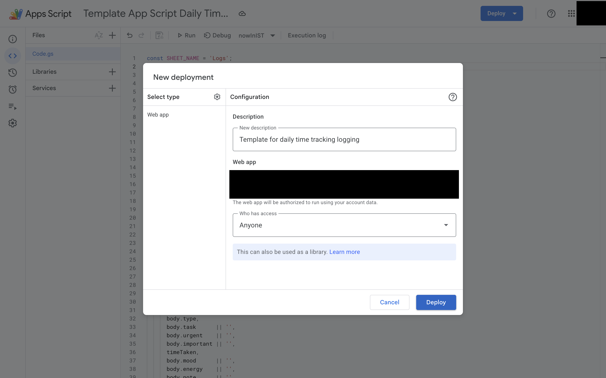
*Deploy → New deployment → Web app. "Execute as: Me", "Who has access:
Anyone" — it has to be Anyone, since the Shortcut can't sign in with a
Google account. That's exactly why the script checks a secret string on
every request.*

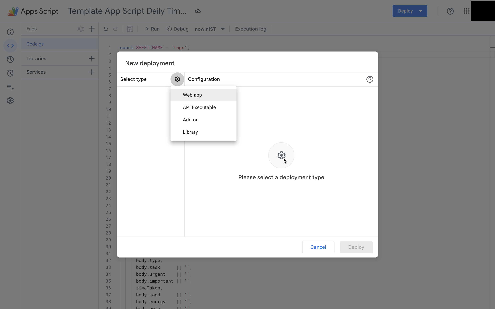
*The gear icon next to "Select type" is where "Web app" lives — don't pick
"Library", that's for sharing code between your own Apps Script projects,
not for exposing an HTTP endpoint.*

Clicking Deploy triggers Google's standard "unverified app" warning, since
this is a script only you've authorized — expected, not a problem:

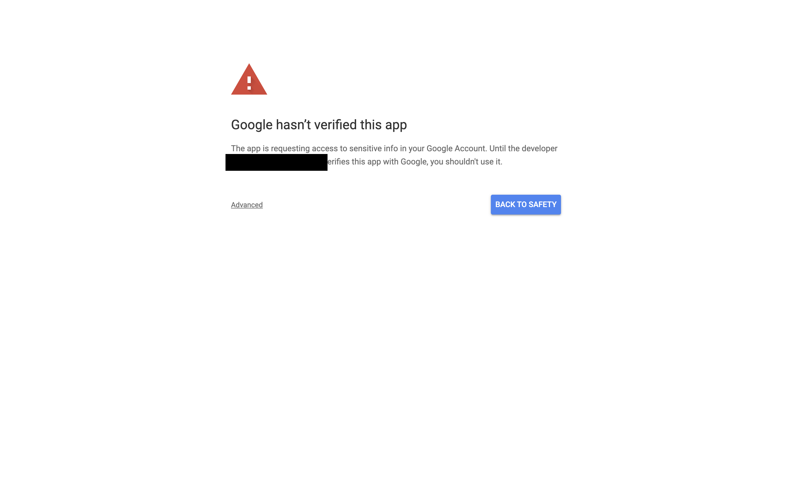

Click **Advanced**, then **trust the developer**, to get the actual consent
screen:

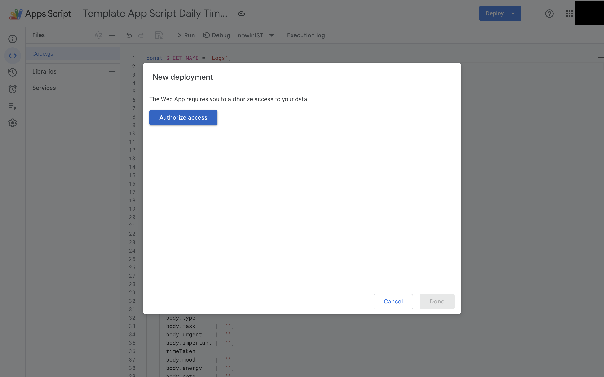

Once authorized, you get a Deployment ID and a `/exec` URL — **this URL plus
your secret is full write access to your sheet, so don't publish it**:

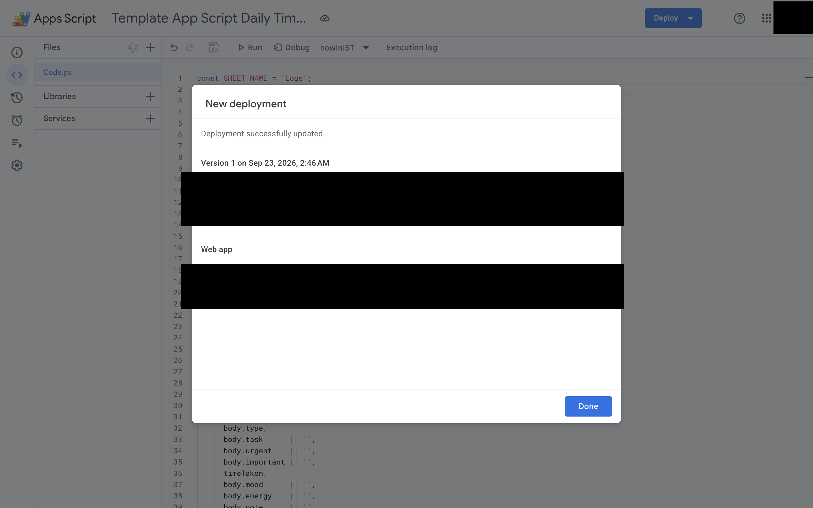

The final, working code, with the timezone fix described below already
applied:

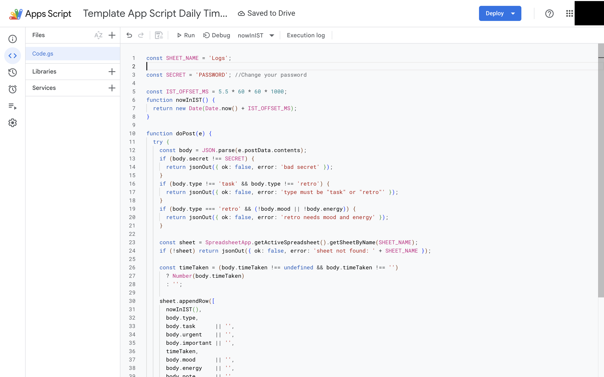

---

## Bug #1: timestamps landing 5.5 hours off

First real bug: every logged row showed a timestamp exactly **5 hours 30
minutes** behind my actual local time (IST, UTC+5:30). That number matching
IST's UTC offset exactly was the giveaway that this wasn't random.

What I checked, in order, and what each one told me:

1. **Spreadsheet's own timezone** (File → Settings → General) — already set
   to Kolkata. Not the cause.
2. **Apps Script project's timezone** (Project Settings, and confirmed via
   `Session.getScriptTimeZone()` in a test function) — also correctly
   `Asia/Kolkata`. Not the cause.
3. **Stale deployment** — a real possibility, since Apps Script deployments
   freeze code *and* manifest settings at the moment you click Deploy, and
   editing the code afterward doesn't update what's live until you
   explicitly push a **New version**. Redeployed. Didn't fix it.
4. **Ran the exact same logic directly in the editor** (`doPost` called with
   a fake event object, bypassing the deployed web app and curl entirely) —
   still 5.5 hours off. This ruled out the deployment and the HTTP layer
   completely: the bug was specifically in how Apps Script hands a raw `Date`
   object to Sheets to be stored as a cell value.

I never got a clean explanation for *why* — `Session.getScriptTimeZone()`
reporting the correct zone while `appendRow(new Date())` still serializes
using UTC contradicts documented behavior, but it reproduced consistently.
Confirmed the direction and size of the error was consistent by running:

```javascript
function testTimezoneBug() {
  const sheet = SpreadsheetApp.getActiveSpreadsheet().getSheetByName('Logs');
  const now = new Date();
  const shifted = new Date(now.getTime() + 5.5 * 60 * 60 * 1000);
  sheet.appendRow([now,     'test', 'RAW new Date()', '', '', '', '', '', '']);
  sheet.appendRow([shifted, 'test', 'SHIFTED +5:30',   '', '', '', '', '', '']);
}
```

The raw row landed 5.5 hours behind; the shifted row matched wall-clock time
exactly. **The fix: compensate for it directly rather than trust any
timezone setting.**

```javascript
const IST_OFFSET_MS = 5.5 * 60 * 60 * 1000;
function nowInIST() {
  return new Date(Date.now() + IST_OFFSET_MS);
}
```

...and use `nowInIST()` instead of `new Date()` in `appendRow`. Since India
has no daylight saving, a fixed offset is safe here — if you're in a
timezone with DST, this constant would need to change twice a year instead.

---

## Part 2: The iPhone Shortcuts

Two shortcuts: **Log Task** (fired throughout the day) and **Daily
Retrospective** (fired once, at day's end). Both just collect a few fields
and POST them as JSON to the same `/exec` URL.

### Log Task

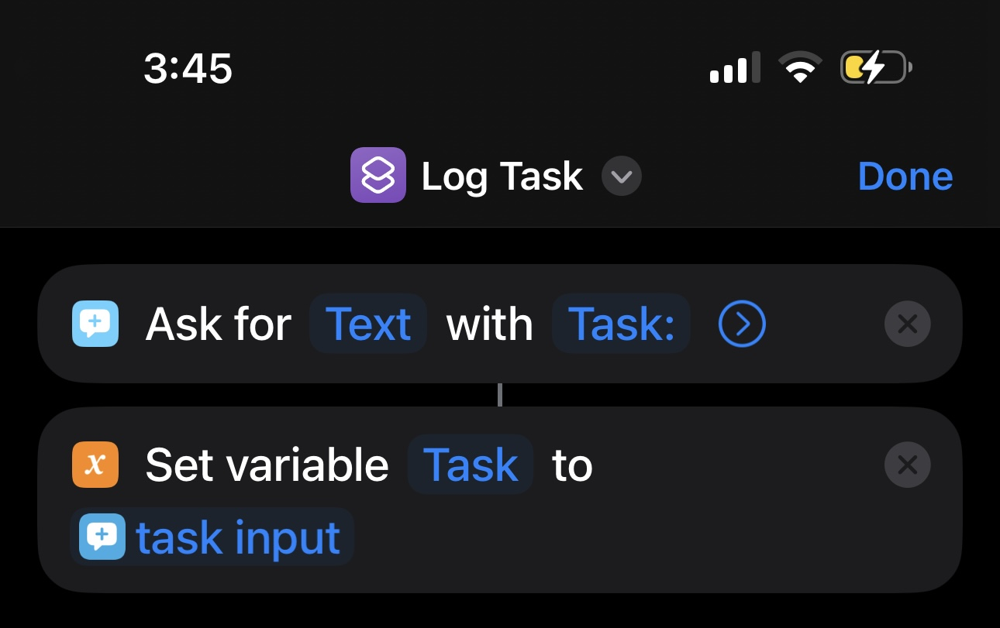

*Ask for Input (Text) → Set Variable Task.*

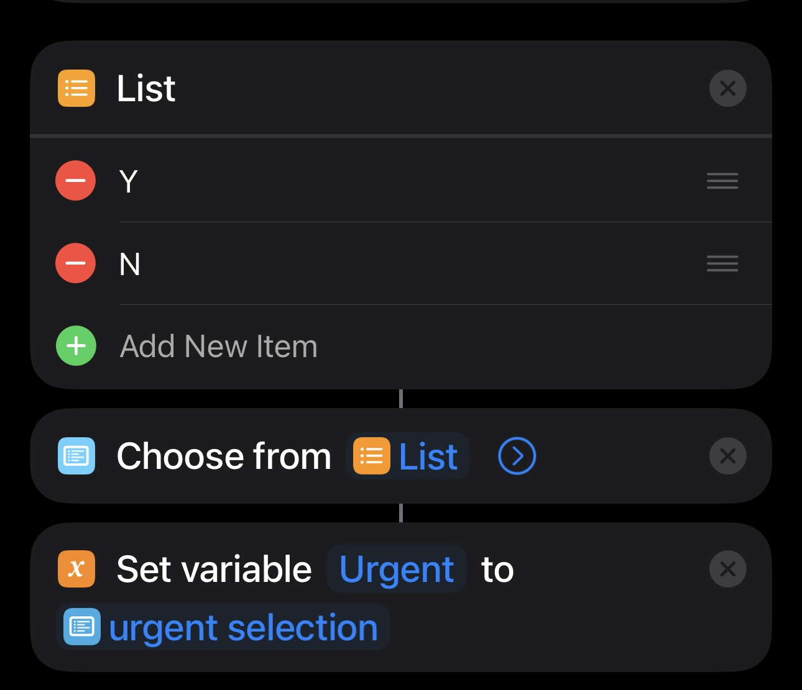

*Choose from Menu with items typed literally as `Y` and `N` — this avoids
a Yes/No-to-Y/N conversion step entirely, since the choice itself is already
the value you want to send.*

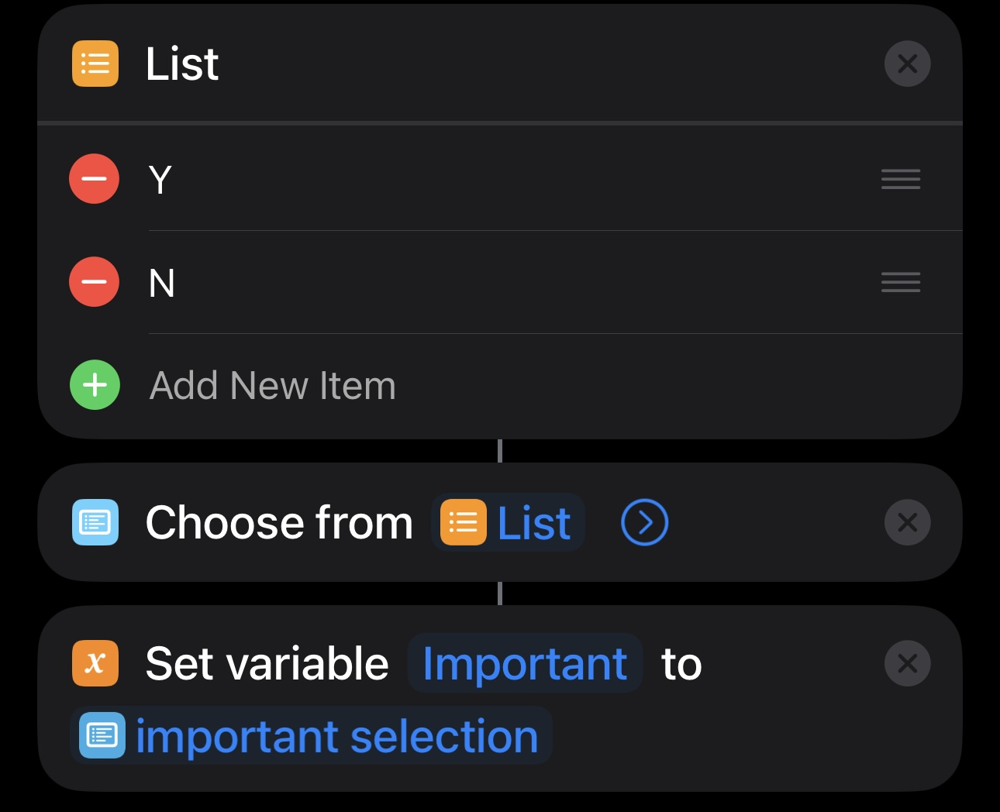

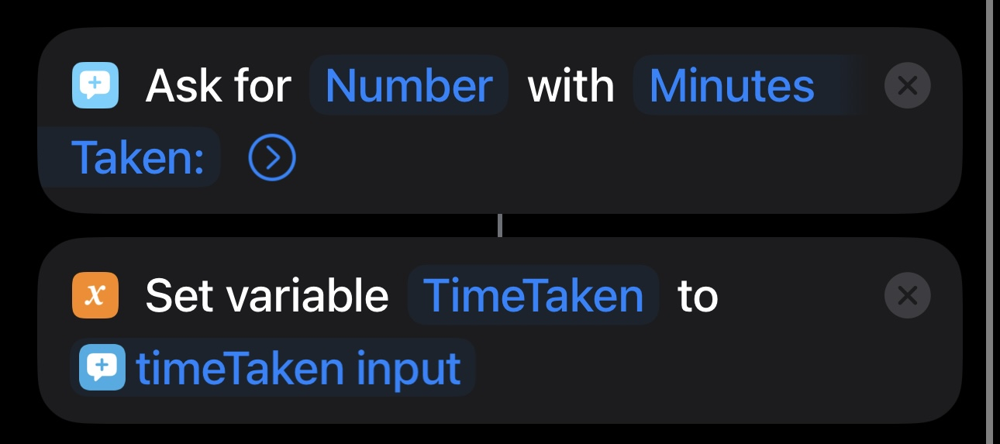

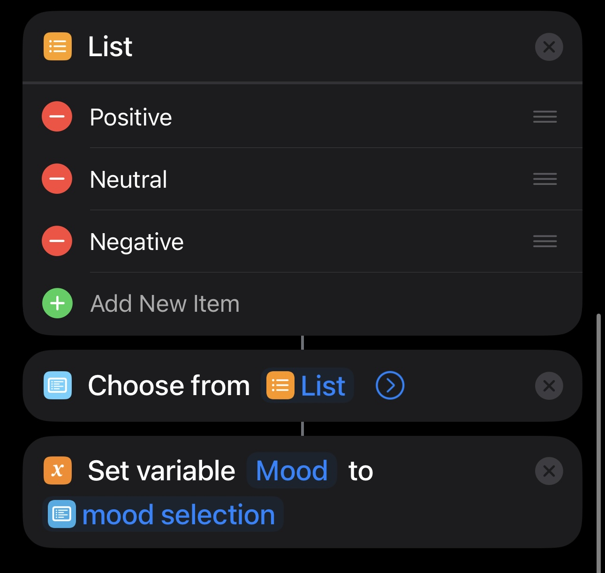

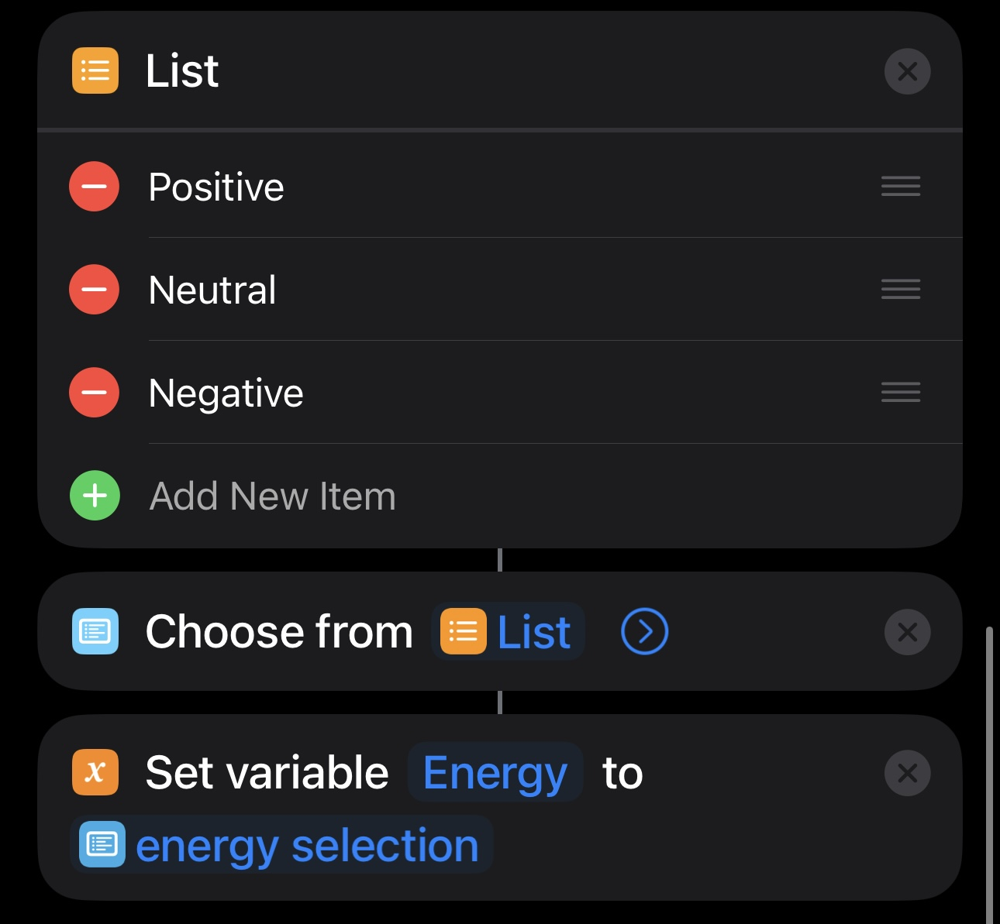

*Mood and Energy are optional per task — the menu items were Positive /
Neutral / Negative / Skip, with Skip resulting in an empty value sent to the
sheet rather than the literal word "Skip".*

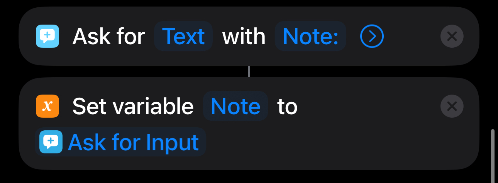

*One more optional field, easy to forget the first time through: a free-text
Note on the task itself, same idea as the Ask for Input steps above. This
one's fine left blank.*

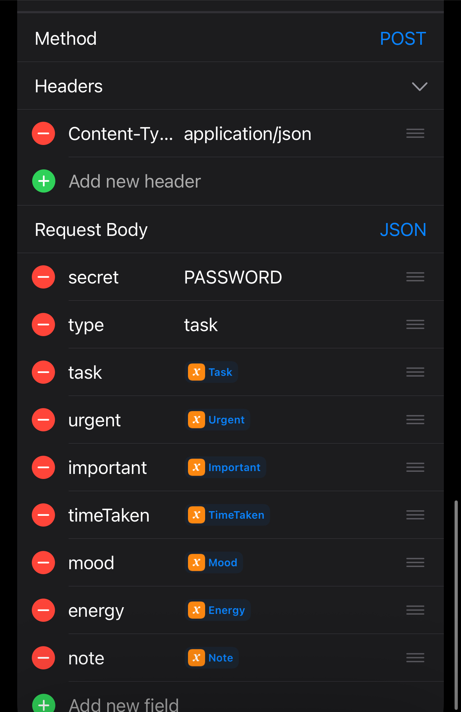

*The final POST — now with `note` included alongside Task/Urgent/Important/
TimeTaken/Mood/Energy. Method POST, header `Content-Type: application/json`,
body fields mapped one-to-one to the variables collected above. (An earlier
version of this screen, from before Note was added, is kept at
[`images/06-log-task-get-contents-url-2.jpg`](images/06-log-task-get-contents-url-2.jpg)
for reference — the one above supersedes it.)*

### Daily Retrospective

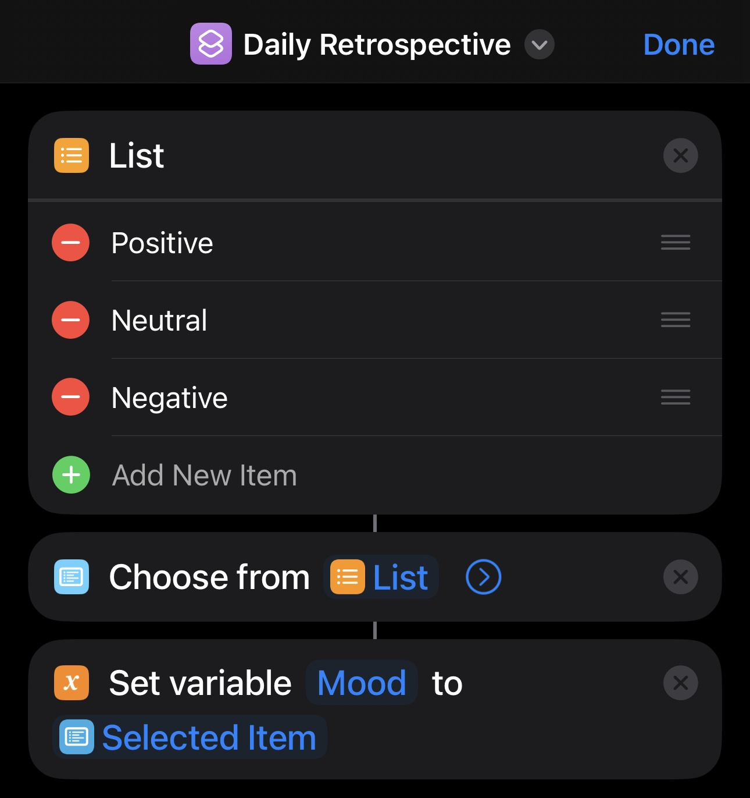

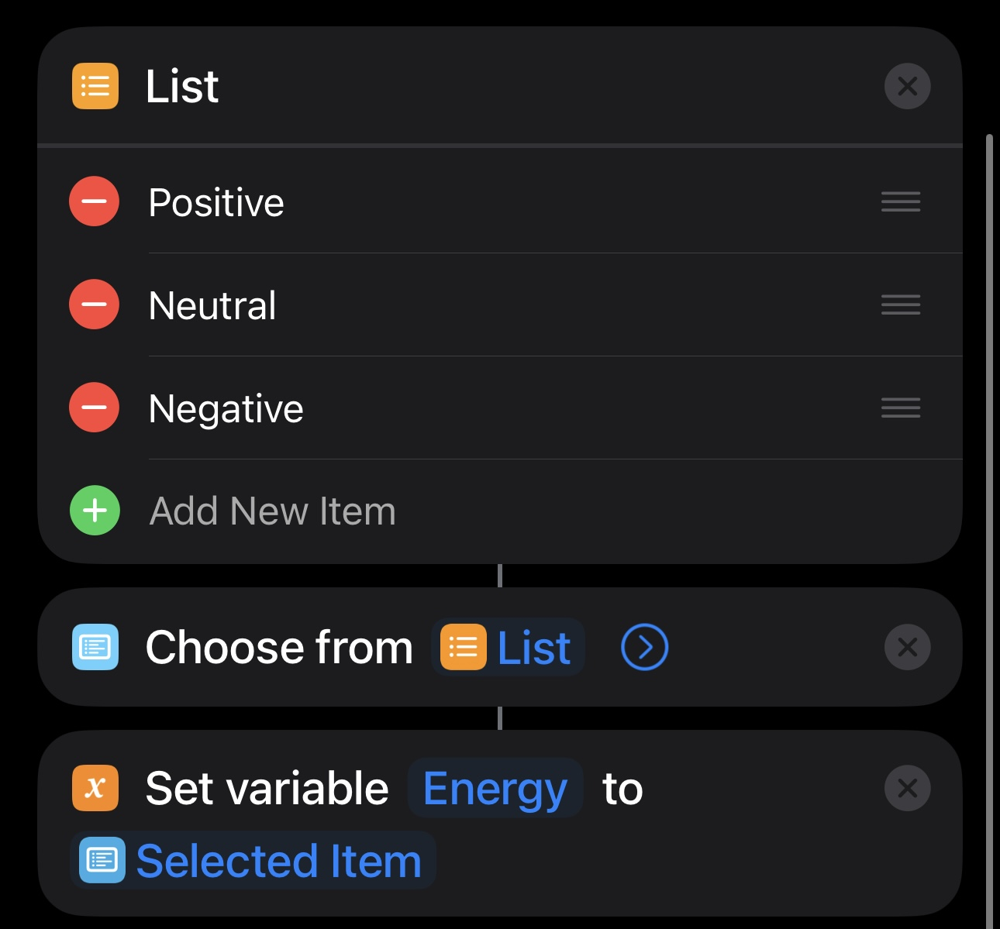

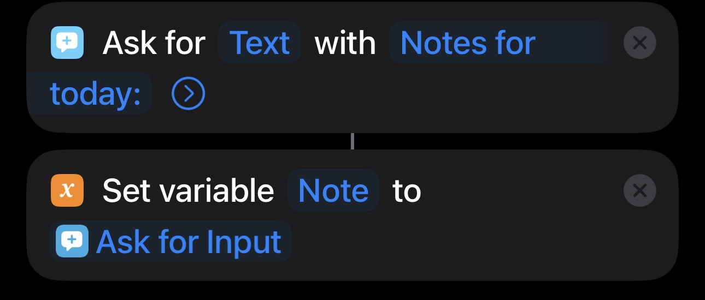

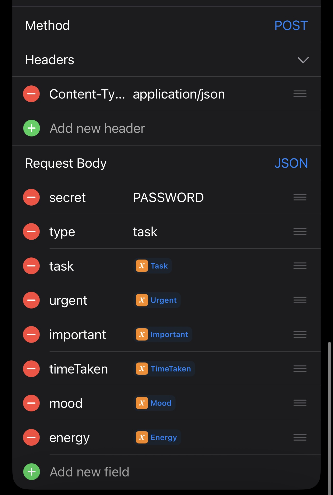

*Mood and Energy are required here (no Skip option) since this is the one
guaranteed daily data point; Note is optional.*

(An earlier version of this same JSON-body screen, before I'd finished
adjusting it, is in [`images/01-log-task-get-contents-url.jpg`](images/01-log-task-get-contents-url.jpg)
for reference.)

---

## Bug #2: every field showing the wrong value

After building both shortcuts, a first test run produced this in the sheet:

```
9/23/2026 3:18:43 | task | test 1 | test 1 | test 1 | 2 | 2 | 2
```

`Task = "test 1"` was correct. But `Urgent` and `Important` had *also* both
become `"test 1"`, and `Mood`/`Energy` had both become `2` (the TimeTaken
value). Every field downstream of Task had inherited an earlier variable's
value instead of its own.

The cause, once traced: in the Shortcuts app, tapping into a value field
brings up a suggestions bar of recently-used variables right above the
keyboard — and it's very easy to tap the wrong pill, especially when a
just-used variable (like Task) is sitting right there. This had happened
**four times in a row**, for Urgent, Important, Mood, and Energy, each
accidentally pointing back at whatever variable was set immediately before
it, rather than that field's own `Menu Result`.

The fix was mechanical but instructive: open each `Set Variable` action,
clear whatever pill was actually sitting in the value field, and explicitly
re-insert the correct `Menu Result` (or, since I'd already typed the menu
items themselves as literal `Y`/`N`/`Positive`/etc., `Menu Result` already
*was* the exact string needed — no extra conversion required).

**Worth knowing about Choose from Menu vs Choose from List**, since it's easy
to conflate: *Choose from Menu* branches — each option gets its own set of
actions right there in the shortcut, like a switch statement. *Choose from
List* just returns a single value from a list and continues in one path. For
small, fixed option sets like these, either works; I ended up using each
menu's own branches to set the variable directly inside each option (no
separate `If` action needed), which removes the "wrong pill" failure mode
entirely for that field, since there's no variable-picker step at all —
just literal text typed directly into each branch.

---

## Testing the whole pipeline without touching the Shortcut

Before trusting the Shortcut, it's worth testing the script in isolation,
cheapest to most realistic:

1. **A fake event object, called directly in the editor** — no deployment,
   no network:
   ```javascript
   function testDoPost() {
     const fakeEvent = {
       postData: {
         contents: JSON.stringify({
           secret: 'YOUR_SECRET_HERE',
           type: 'task',
           task: 'Testing from editor',
           urgent: 'Y',
           important: 'N',
           timeTaken: 5
         })
       }
     };
     const result = doPost(fakeEvent);
     Logger.log(result.getContent());
   }
   ```
2. **curl against the real deployed URL** — the first genuine end-to-end
   test, no Shortcut needed:
   ```bash
   curl -L -X POST 'YOUR_EXEC_URL' \
     -H 'Content-Type: application/json' \
     -d '{"secret":"YOUR_SECRET","type":"task","task":"curl test","urgent":"N","important":"Y","timeTaken":10}'
   ```
   The `-L` matters — Apps Script Web Apps respond with an HTTP redirect,
   and curl won't follow it (and so won't show you the `{"ok":true}`
   response) unless told to.
3. **The Shortcut itself**, last, once 1 and 2 both work — so that if
   something's still wrong, you already know it's the Shortcut's wiring, not
   the script.

---

## A note on security, since this article has screenshots

Every screenshot in this repo that originally showed the live deployment
URL, Deployment ID, or the Google account email tied to the project has been
blacked out — not just blurred, fully covered with solid rectangles, since a
blur or a thin marker stroke can still leak edges (an earlier redaction
attempt of mine, visible faintly at the very edges of a couple of the
Shortcuts screenshots, did exactly that before I fixed it here). If you're
publishing your own version of this walkthrough:

- Treat your `/exec` URL as a credential once it's paired with your secret —
  don't post it, even redacted "by eye."
- Change the placeholder `SECRET` in `Code.gs` to your own long random string
  before deploying — the version in this repo is intentionally left as
  `'PASSWORD'`.
- A solid black rectangle, fully covering the text with margin, beats a blur
  or a hand-drawn marker scribble — those can leave a legible edge.

---

## What's next

Everything downstream — the Urgent/Important matrix, per-task mood/energy
percentages, the retrospective pull — reads from the same `Logs` table via
plain spreadsheet formulas (`COUNTIFS`, and a `LOOKUP`/array-division trick
for pulling a single day's retrospective value, wrapped in `ARRAYFORMULA`
since Google Sheets needs that explicit hint where Excel doesn't). Any
future dashboard — a weekly view, a mood-vs-urgency correlation, a streak
counter — just reads the same table. Nothing about the logging side has to
change to support it.

If you're setting this up yourself: copy the [template sheet](https://docs.google.com/spreadsheets/d/1Rv4KTB3ym3NJeISpJA3bVLfy3RnNjRVR1LOl4zLqS34/edit?gid=592280567#gid=592280567),
paste in [`code/Code.gs`](code/Code.gs) via Extensions → Apps Script, deploy,
and build the two Shortcuts above pointing at your own URL and secret.
